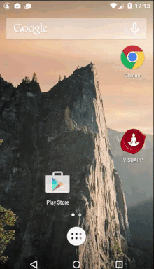

Recently the small but strong team of the boy the girl and the cat placed on the Google Play new update for VISUAPP.

## People saying thanks

We believe that application is something alive that couldn’t be stable. Users need new features they want more. And we want to do more for the users. And that’s beautiful. 

We got around 1000 emails where people saying thanks for that finally they can take their vision boards out from home and that since VISUAPP appeared on their phones they was able to feel for the first time how the law of attraction works. It was pure pleasure to listen to the people and help them. So the next VISUAPP release was inspired by all those wonderful letters and feedback. We would like to describe briefly three the biggest features.

## MUSIC
Music can change your life and that is a huge and important part of meditation. So now in VISUAPP it’s possible to set-up any music for visualization you want. Follow this simple & easy steps to select your favorite music for visualization.

1. From the main screen click on Settings button
2. In Settings click on mucic icon (top right).
3. Choose the music you like by clicking on any row (just in the middle will work).

**Note**: you can listen any particular music clicking play/pause button.

## Dreams reorder was another big change.
Now all dreams can be moved on required place on the board. Now VISUAPP is more flexible then ever!

You can do it like this.

## Inspirational quotes 
Another big feature that we have done was inspirational quotes preview. Inspiration is what you need to soy on your way and never give up. So now before visualization small screen with motivational quote will appear and will inspire you and help you to concentrate.

And now we are so happy to receive messages full of gratitude. We are always so glad to continue our wonderful communication with the best users in the world. 

So please enjoy VISUAPP and suddenly all your dreams come true.

