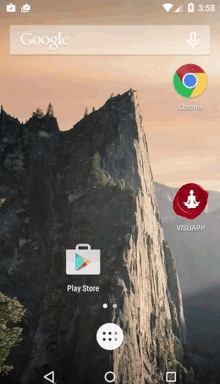
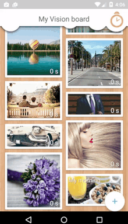

There are some secrets about VISUAPP application that will make your experience super satisfying. Here they are.

## You can add images from browser 
You can put photos to vision board right from the browser. All you need is just find the photo on the browser -> make long press on it -> click "share to VISUAPP". The photo will be there without even leaving the browser.

> Find the photo on the browser -> make long press on it -> click "share to VISUAPP"

## You can leaf through your dreams
With just simple swipe you can leaf through your dreams. Just look how to do it.

> To leaf through your dreams swipe the photos on the edit screen

## You can add several photos at once
Click on the plus to add the dreams and then multiselect (the icon with 4 homes)

> Use the multiselect button to add more than one photo on your vision board
