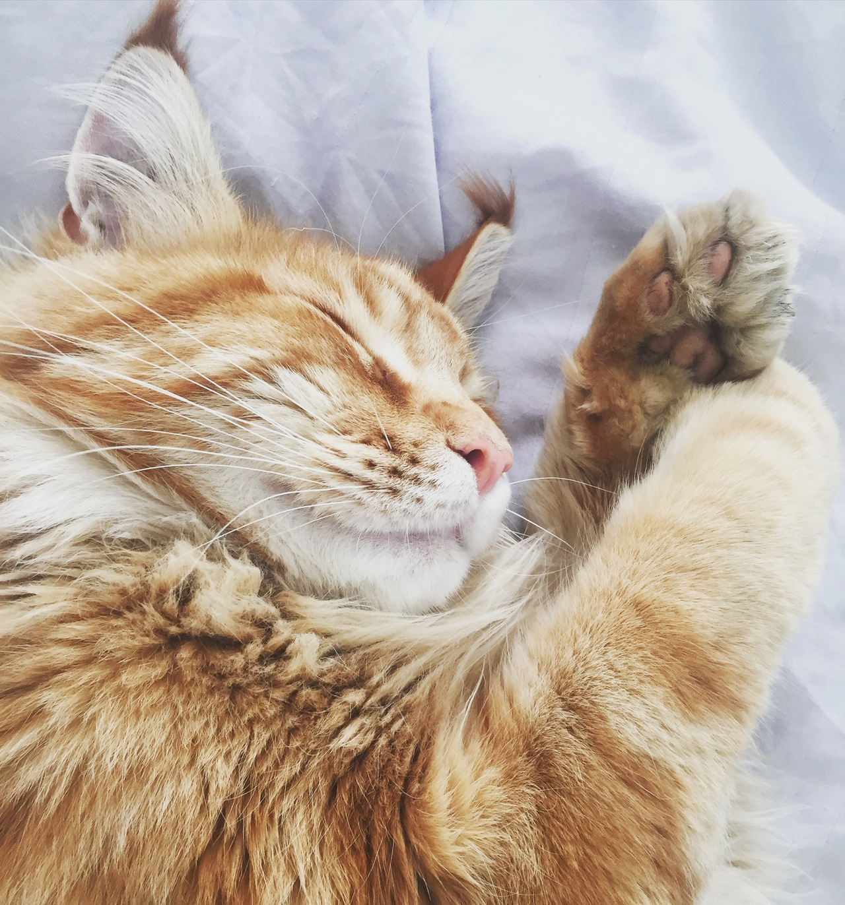

We are all living in stressful world, and here are some simple tips from VISUAPP that will help you to deal with the stress.

## 1. Dedicate some time to relax 
Practice yoga, read, draw, listen to music, meditate. Stop think that you are too busy for those activities. The first step to success is to love yourself, don’t be greedy to dedicate some time to relax.

## 2. Eat healthy food and do physical exercise
Your body reacts once you are in stress, don’t let your emotions affect your physical state. A sound mind in a sound body.

## 3. Plan Your Day
Planning can help you to control more what is going on. The more you follow the plan the less stress you will have.

## 4. Focus on most important task
Stop doing something that is not important. You should concentrate only on those things that you find useful and valuable. Doing the things that seems meaningless will give you even more frustration.

## 5. Accept that you cannot control everything
Just accept. It's ok if you can't control something.

## 6. Talk about your stress
Find someone that you trust and talk to them about what is bothering you. This will take away emotional tence.

## 7. Get enough sleep
You should sleep enough even if you don’t have stress

## 8. Spend time with animals
Studies show that interactions with animals can decrease stress. When you communicate with your pet the level of the stress-reducing hormone oxytocin is increasing.

## 9. Visualize
Never forget about your dreams. Remember that you become what you think about.

