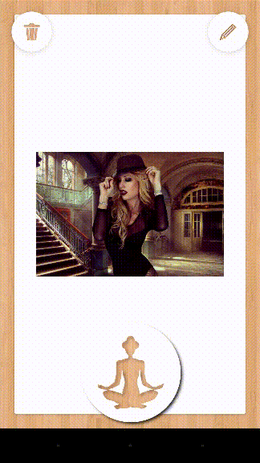
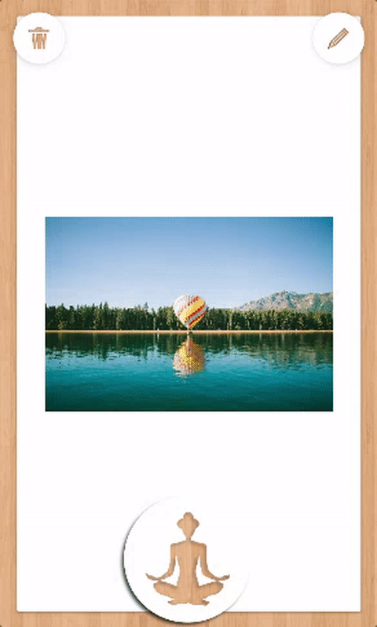

Hello friends :) we have just published the new update of VISUAPP on Google Play. From this moment you can use slideshow visualization!

It's a special mode of visualization where you can visualize several dreams during one visualization session.

We are so happy to present it to you! Let's see how it works.

The first thing you should know is that there're two ways to use it. One is while you're creating or editing an alarm for visualization.
And another is when you are going to visualize certain dream 'manually' from you vision board.

To visualize from the board you need to swipe the visualization button with the yoga icon to the right or to the left.
Then you will see the yoga with six hands which means you are in slideshow visualization mode.

Just do like this.

*Swipe the yoga button right or lest to switch to slideshow mode*

To visualize in slideshow mode from the reminder you need to configure it on the notifications sections.
Now to edit the notifications you need to click on one of them and a new window with notification setting will appear.

*Click on one notification to enter to the notification settings screen*

In the notification settings you can establish the time, date, duration and the mode of visualization. There are two different modes of visualization: single and slideshow. Single mode is the common mode when you are able to visualize a single dream at one visualization session. The slideshow mode allows you to visualize several dreams in one visualization session.

You can configure the frequency of the dreams. To change it you need to setup the slide duration. Just pay attention on that to use slideshow correctly.

Just do like this.

*Configure the frequency of the dreams by changing slide duration*

The visualized time of each dream during the slideshow will be properly added to the general visualized time for each dream. This way you will always be able to control your vision board no matter in which mode you are visualizing.

We hope you will enjoy the new slideshow mode and we wish you all your dreams came true!

Please post a comment below if you have any feedback or question.

