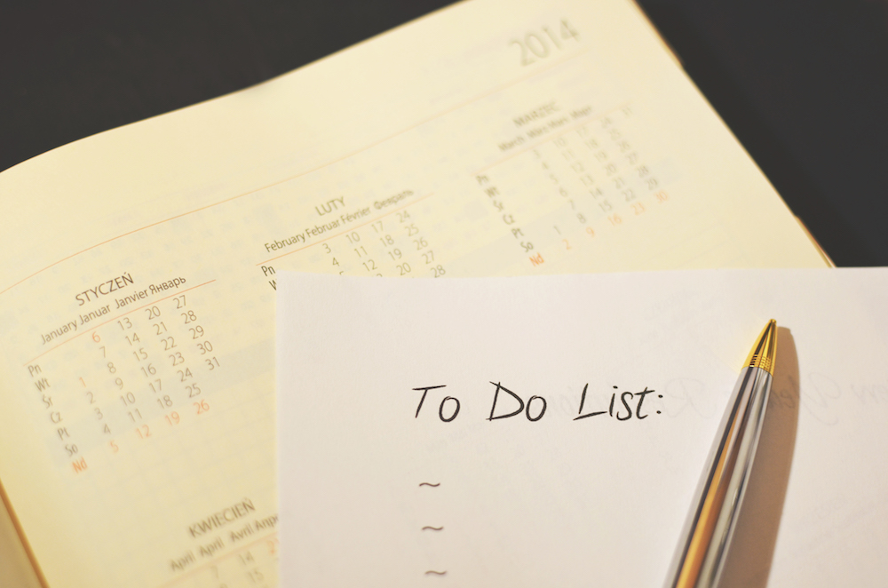
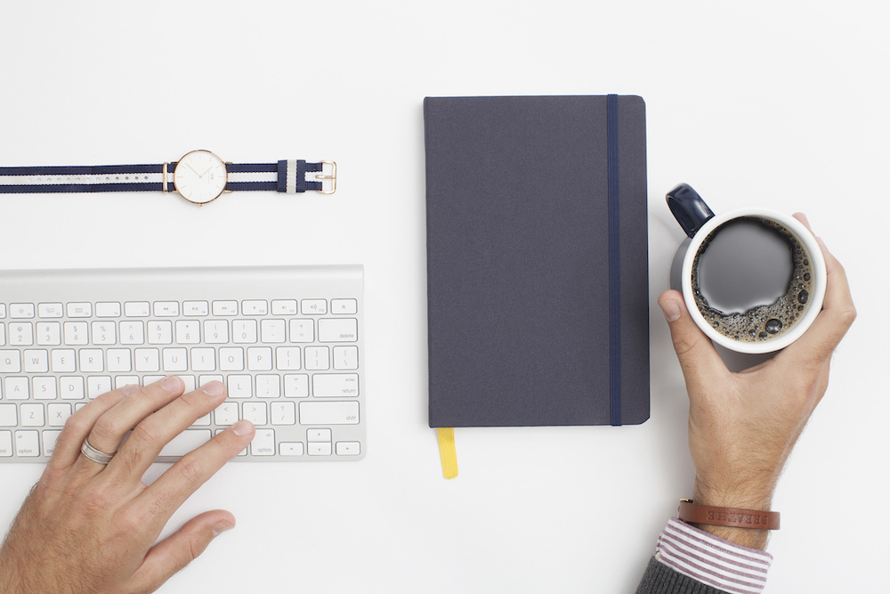
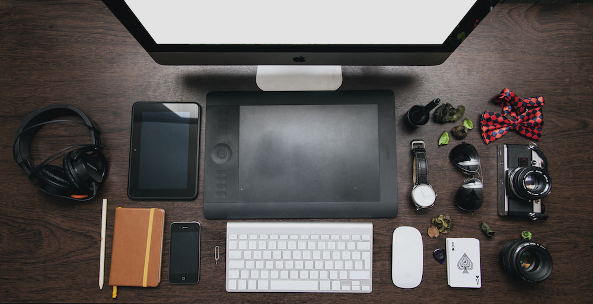
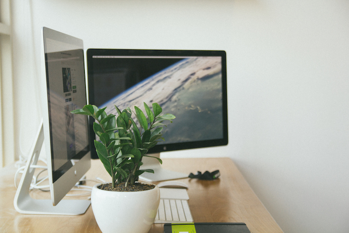
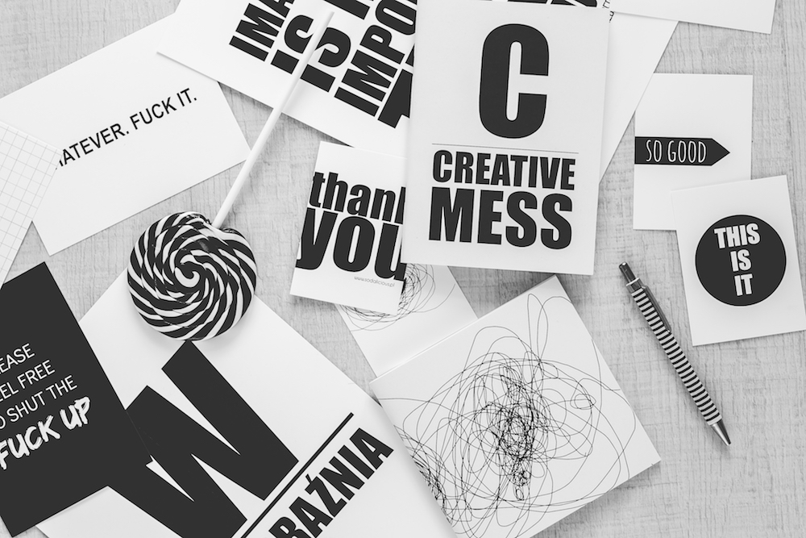

Do you want to be organized to achieve your goals? VISUAPP has some suggestions for you! Let's see the 9 most important ways to stay organized.

First of all you should organize your mind and your thoughts.

## 1. Give yourself a rest

People has a common mistake these times. They think they can be successful by reaching something. But you can't consider yourself successful once you're rich but always tired, upset or ill. Don’t overwhelm yourself. So start from slowing down. Give yourself a rest. Stop this crazy running for something that takes your energy away. Don’t be a perfectionist, being a perfectionist it's just not perfect.

## 2. Reward yourself

Don't think about what you haven't done. Think about what you did. The Law of attraction says that everything is a magnet. So all the time once you achieve something just give yourself a reward, even if it will be some candy or one evening watching your favourite movie. But remember, it's important to say that you are rewarding yourself for something good that you've done or achieved.

## 3. Fight for concentration, that is like a gold today

Do you remember the time when you were reading some book all week long and you were ok with it? You were totally concentrated on it and it was ok. Well now that is a luxury. Can you read that book during 4 hours without checking your notifications on mobile? And what is the amount of tasks that you have started but not finished. Isn't it bigger than 5 years ago? Nowadays we are living in the time of multitasking, stress and luck of concentration. To protect ourself from it we are procrastinating, but actually that is just a natural way of how brain protects himself. But you can and should control it. Concentrate better, and don't be afraid not to respond to someone immediately in whatsapp, everything can wait. But to finish your current task is more important than someone's tweet. Today, winners are those who can concentrate.

## 4. Write down everything

Your plans, books your need to read and even the most stupid ideas. You write it down to your notebook, or in your phone notes or put the stickers on you fridge. No matter where and how, but don’t rely on your memory.

## 5. Delegate

"If you want to do it right, do it by yourself" - someone said. But actually that's not true. The most productive and successful people in the world know how important it is to delegate something to another person. You can't do everything by yourself. But you can always delegate something. The trick here is that you need to explain why the task you are delegating is important and which benefit everybody will have from it.

## 6. Take care of your body.

Today the "Healthy lifestyle" for the majority of us it's just a hackneyed fashion phrase. But do we really understand how important it is? Just remember, simple stretching and healthy breakfast in the morning will help you in both, physical and mental way.

Once you have ordered thoughts it's time to think about your things.

## 7. Keep your things in their proper places

Now you know how important it is to concentrate on one concrete thing you're doing. Well that is why you should get rid of all unnecessary things in your life. Clean you working desk before and after work, clean your bath before and after taking a shower, clean your sleeping room before going to the bed and after waking up. Put things back right away!

## 8. Get rid of something before buying something new

We all love new things, we are all inside crazy shopoholics, but no one loves to have a house full of unnecessary stuff. Stop buying unnecessary things and create new rule of your life: buy something new only after getting rid of something old.

## 9. Schedule your cleanings

The human nature tends to find rhythm in everything. So create your own rhythm of organizing yourself. Say to yourself that you will dedicate 10 minutes a day to maintain your things, 1 hour a week to clean up and one day in a month for general cleaning.

Anyway, if you like to live in a total chaos, it's ok so the chaos is the highest and the most complicated form of organization.

