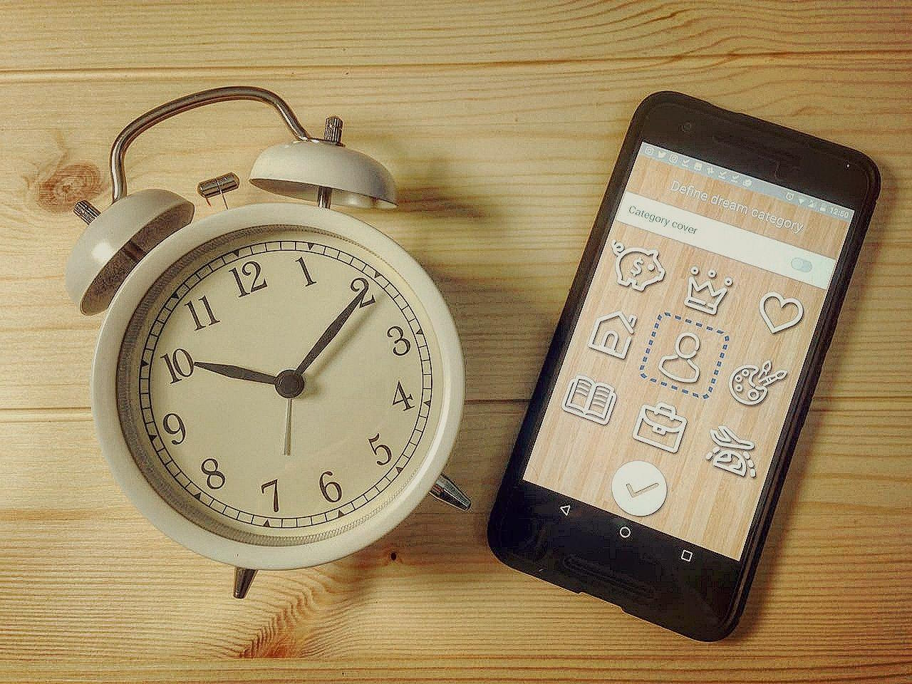

During the last month we have received more than 2000 emails, messages and comments full of thankfulness and gratitude for new Feng-Shui functionality in VISUAPP. 

If you still don’t have Feng-Shui board please, read this till the end to figure out how to get it, if you already use it we still suggest you to read this blog post as you will find a lot of useful information here. Let’s go!

## What is it Feng Shui vision board?

Feng-Shui vision board is a new functionality of VISUAPP that allows you to categorize your dreams and create Feng-Shui 9-section vision board. This board allows you to filter your dreams by category and form a square of 9 most important dreams that you have. Each of 9 photos represents 9 most important aspects of our life: **money, fame, relationship, family, health, creativity, knowledge, career and travel**. Just decide which photo should form a part of your square. 

**Congratulations, from today you have 9 more vision boards that allows you to concentrate in one particular area of your life!!!**

## A little bit of history

Feng Shui vision board takes the root from the antique Bagua map that was invented around 2500 years ago and even Confucius was involved on it creation. 

In Chinese “Ba-Gua” means “eight-sided”, showing that the map has eight sides representing the most important areas of our life that we have already mentioned above. The center of the map represents your health, physical and emotional state. 

 
**We decided to modernize this approach and spread around the world this antique knowledge … but in the most modern way that you could ever imagine.**

## How to use Feng-Shui vision board
To form Feng-Shui board  you should do next:

- Assign category to your dream by clicking on the upper center button on dream preview screen

- Mark the switch ON for "Category cover" if you want this dream to represent the section on of the Feng-Shui board

- To observe all your dreams from particular section click on appropriate square on Feng-Shui board

## How to get Feng-Shui board? 

If you want to get promo code for the Feng-Shui board just make this simple steps:

- Make a post to Instagram with the place you want to visit and write the next description “My dream is to visit  _____. It's possible with VISUAPP!”  along with #dreamwithvisuapp hashtag

- First 50 users will receive promo code for FREE download of Feng-Shui board

