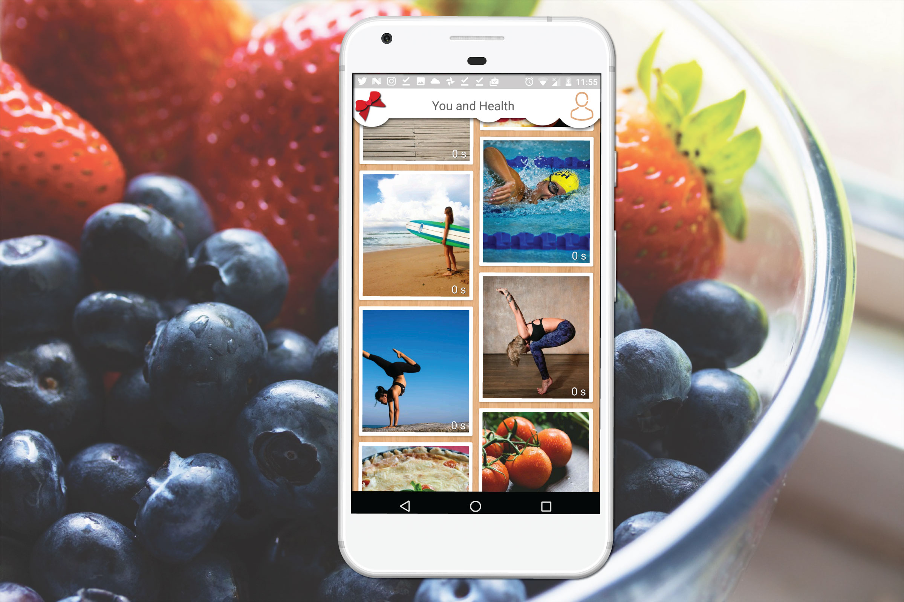
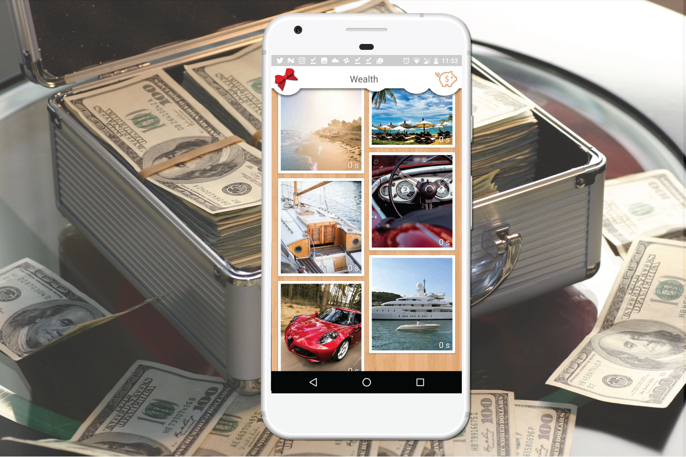
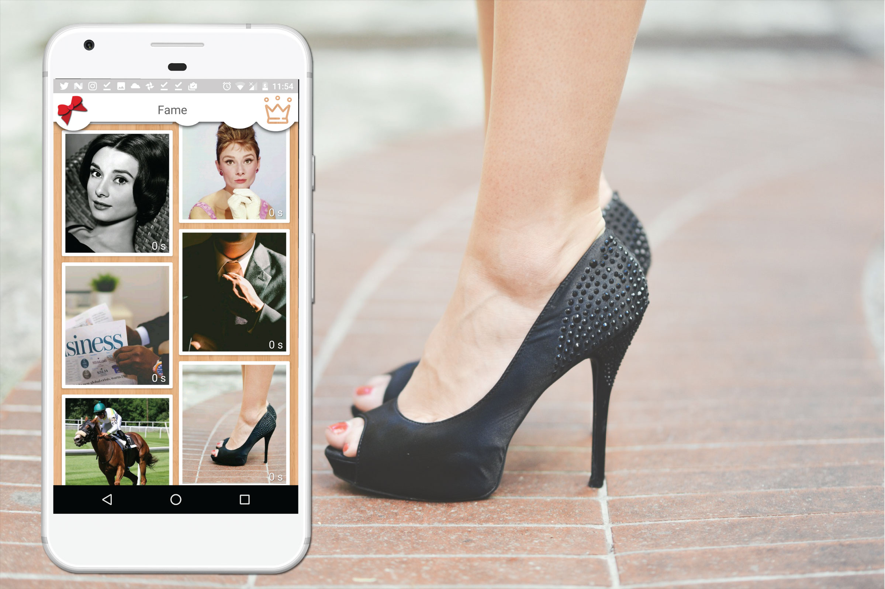
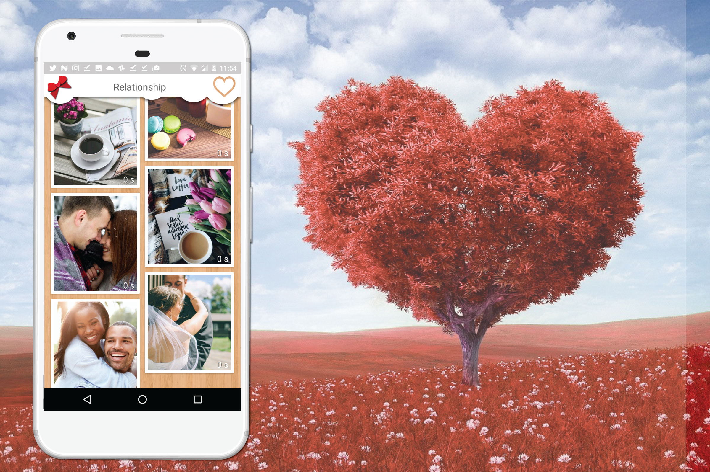
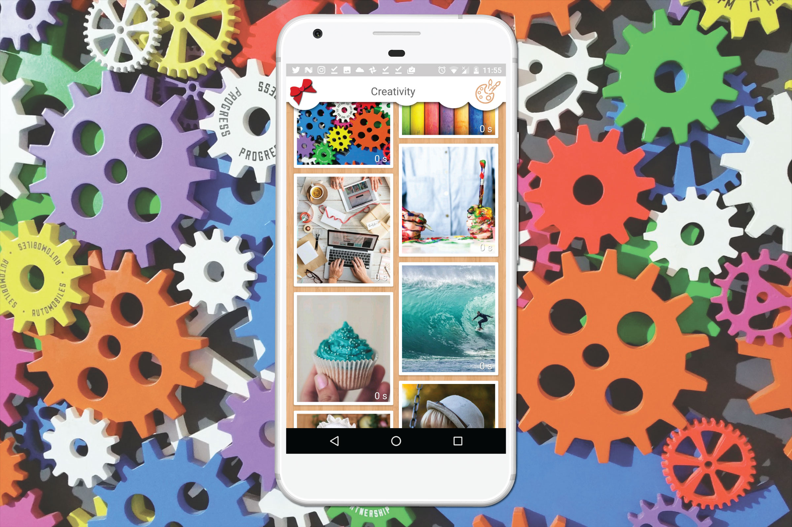
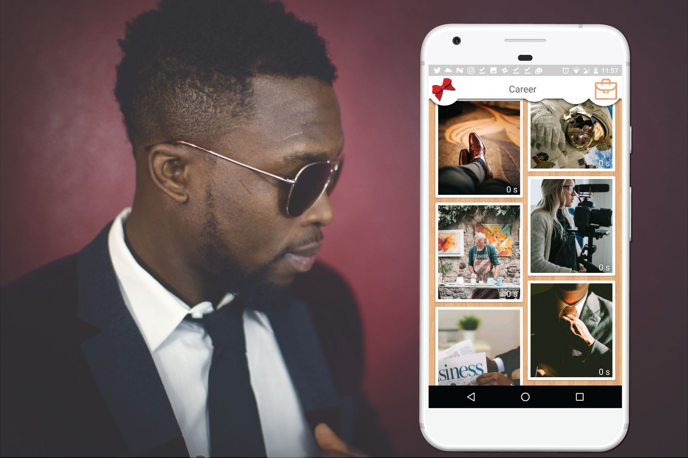

So now you know that Feng-Shui vision board is a board divided in nine sections. Each of those sections represents one of the most important areas of our life: love, money, fame, family, health, creativity, knowledge, career and travel.

Let’s take a look on each part of the Feng-Shui board:

## You & Health (center) 

This section represents your physical and emotional health, your inner powers and your readiness to change and influence in all other aspects of your life. This section is placed in the center of the map and connects all other areas of your life (the other segments of the map).

You should place here the photo of yourself in your best mood and your best physical state where you are happy. You can place some photo of the day where you had some success, for instance, when you were hired for some job, met your soulmate or maybe simply passed the exam in university.  

## Wealth & Prosperity 
In this category you should place things that represent prosperity. All that you already have and feel grateful for it, and all that you want to have. Here you should place money, property, jewelry, cars and luxury.

## Fame & Reputation
This part shows your fame and how you wish to be known in the world. If you want to be a famous entrepreneur or super model, successful actor or astronaut. All depends on you, just turn on imagination.

## Love & Relationship
In this section you should place how you see your perfect relationships. It will help you to find your perfect soulmate or improve the relationship with your current mate. Think what is the perfect love for you, do you want to have a passion in love and date a sexy and hot partner, or maybe you want to have someone smart and shy to have cosy and calm evenings together. What are you dreaming about? Have romantic dinners with candles every night or maybe you want make some crazy things together like jumping with a parachute? All this you should place under love category.

 

## Creativity & Children
This area represents your creativity, open mindedness, fullness, imagination and activate your youthful energy. Place here all kind of activities and hobbies that you would like to do. At the same time this section is responsible for the children in our life. So if you are trying to have a baby or improve the relations with your son or daughter this is the section where you should concentrate your attention more.

 

## Travel and people you want to attract into your life
This section describes your ability to move, achieve goals, the level of your life activity and your social life. Here you should place all the countries, cities and all parts of the world you want to visit or live. Place here the way how you would like to spend time with your friends and people you would like to attract in your life.

 

## Career & Life path
Under this category you should place all the dreams related to your career and hobbies. Place here images of profession in which you want to develop, all kind of things you would like to do, occupation and work of your dreams. This area is responsible for your work, career and life direction. This might be complicated in case you don’t know exactly your purpose in life. To make it easier we suggest you to read our blog post about [how to find what you want in life](https://visuapp.github.io/blog/find-what-you-want/). 

 

## Knowledge & Skills
You are wrong if you think that the university and school are the only places where you need to study. Getting new knowledge is an exiting process that will help you to achieve all your dreams. Knowledge is the key to success. Think about what you need to know to manage your business or to improve your health. Maybe it’s time to learn one more language or maybe you want to conquer your partner by making professional massages. Don’t be boring, search for knowledge and believe, you will never regret about it.

 

