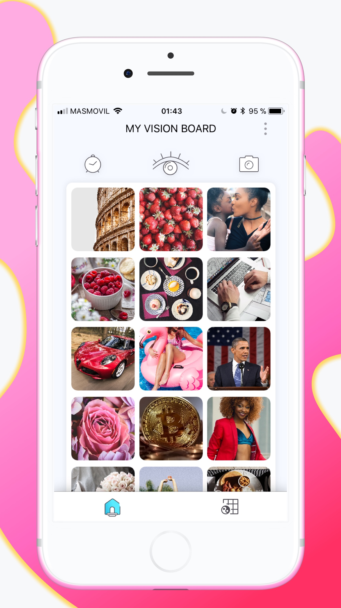
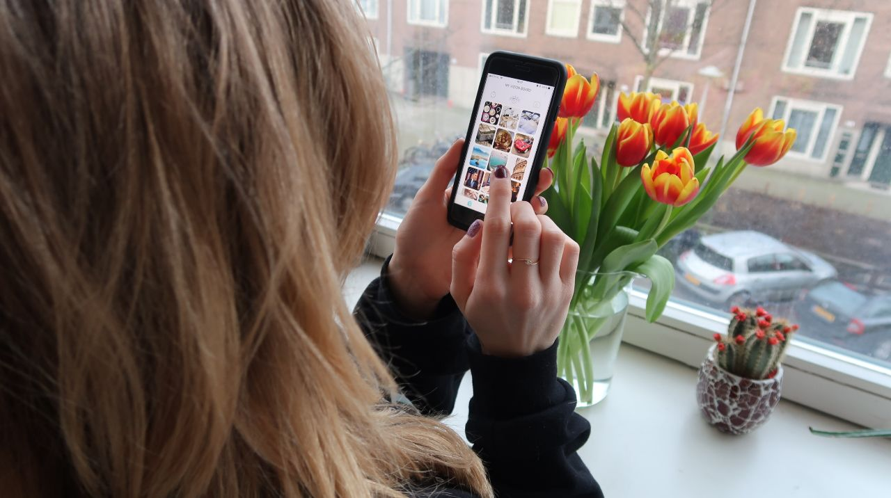
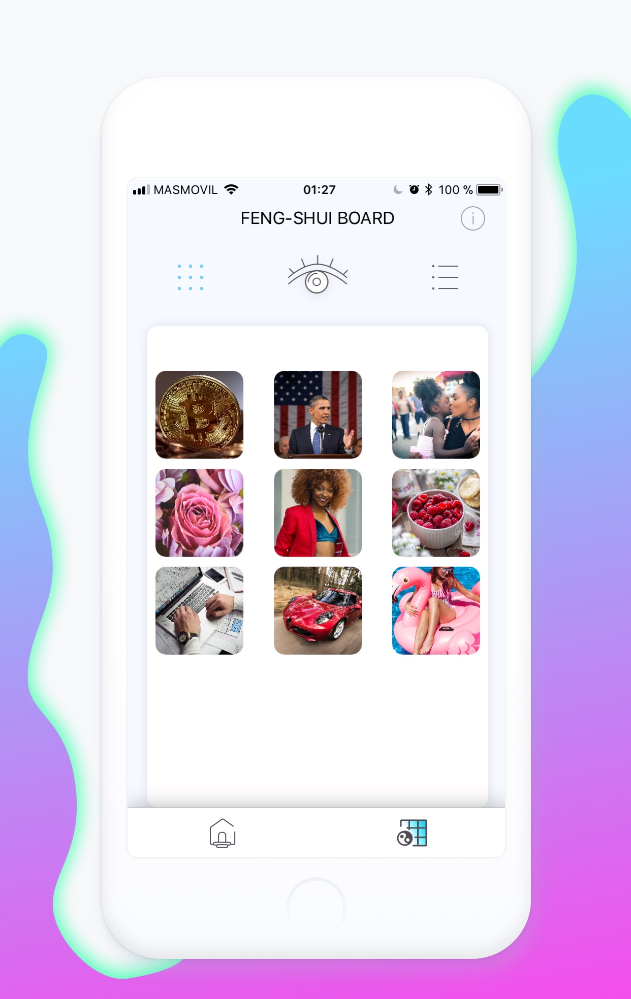
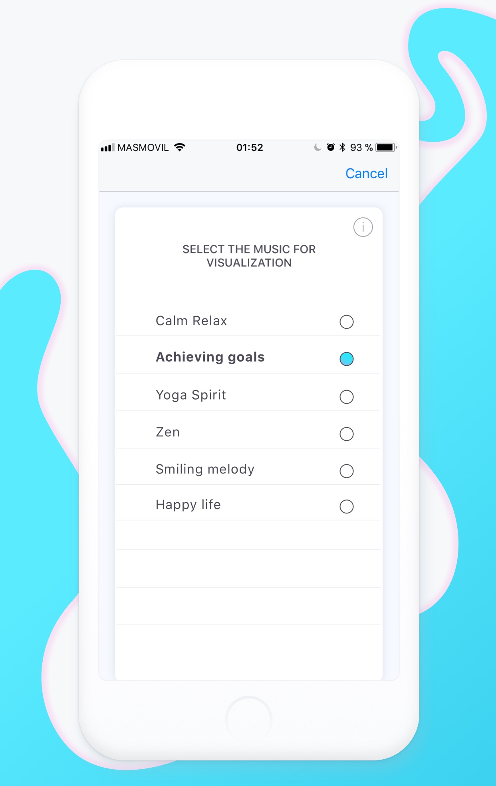

VISUAPP for iOS: new platform, new design, new dreams and new life

We are incredibly happy to announce that VISUAPP is ready for your iOS devices! But first of all we want to say thanks to our precious users! You are our inspiration, our reward and our main motivator! We believe that VISUAPP makes the world better and hearing your stories about dreams coming true is just real happiness for us!

Now let's go see its main features:

## iOS VERSION

The biggest request from our users in 2017 was VISUAPP for iOS. People constantly share their knowledge of imporance of concentration and meditation with their friends and families. So we realized that iOS version of VISUAPP is critical for our users. That's why right now VISUAPP is ready for everybody who uses iPhone or iPad! Simply click on [this link](https://itunes.apple.com/us/app/visuapp/id1317811945?mt=8) and you will discover totally new, better and improved VISUAPP!

## TOTALLY NEW REDESIGN

As you already know, listening to your opinion is our first rule! We worked hard and made a lot of experiments to improve user experience. So that you would not only enjoy the beautiful interface but also a intuitive and simple user experience.

Our task was not simple. All the dreams are different and they are all very important. Once inside the application the user immediately should be able to start visualization or reach all the required info about his dream just in a couple of clicks. And at the same time everything have to look beautiful. It should be easy and smart. Even a person with frozen hands who's waiting for a bus in the cold winter morning in Norway should be able to start the visualization just with a few clicks. We carried out the tests, analyzed different variants and options, listened the suggestions and opinins about several prototypes and finnaly we were able to find a solution. Now everything is way more simpler, just by clicking on a dream you start visualizing, and by simple swipe up you will get to all the necessary details of your dream!

Also we reorganized the main functionality, so reminders, as the most important feature, were placed in the home screen. And all other features like music or instructions we combined under the settings section.

## BETTER VIEW OF FENG-SHUI CATEGORIES

Feng-Shui board is the most important board in the VISUAPP! Having your dreams divided into categories is not just a functionality, it's a big visualization methodology that was developed thousands of years ago. We also decided that in addition to the classic option where your screen is divided into 9 sections and you see one dream from each sector of life, you need to see all the dreams at the same time and know which category they belong to. So we added a new view of the Feng-Shui board where all dreams are shown in groups so you always know how many and what dreams you have in the travel section, love, work and indeed in any of the categories!

Moreover, like Instagram, you can switch between two modes of viewing your Feng Shui board. Just click on those icons near to the eye icon. 

## MORE MUSIC

Music is the most important ingredient for your visualization and meditation. What can be better than listening the music of your choise while dreaming. Therefore, in the new version of the VISUAPP, we not only allow you to select any music from your phone, but also expanded the list of predefined melodies that we specially prepared for your meditation sessions! Go try it right now!

## What's next?
Happy to say that soon our android users will be able to have newly redesiged app with new improved features and a lot of new pleasant surprizes!

THANK YOU! MAY YOUR DREAMS COME TRUE! WE BELIEVE IN YOU!
